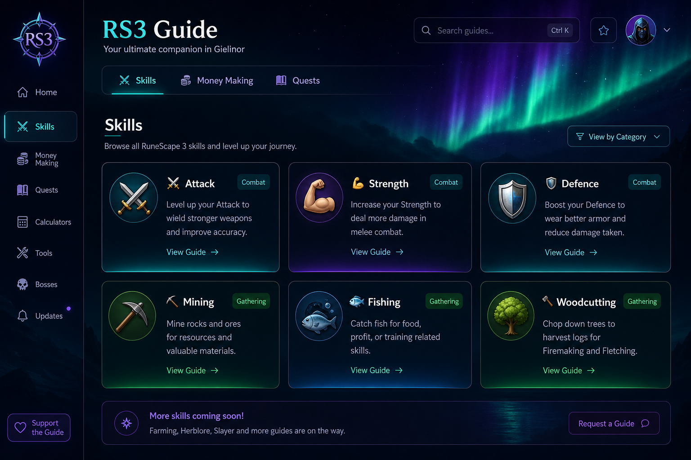
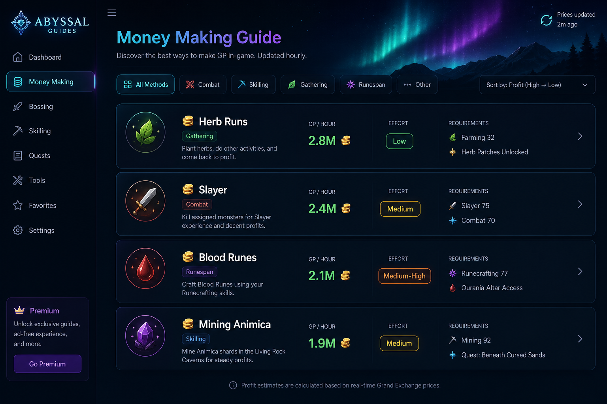
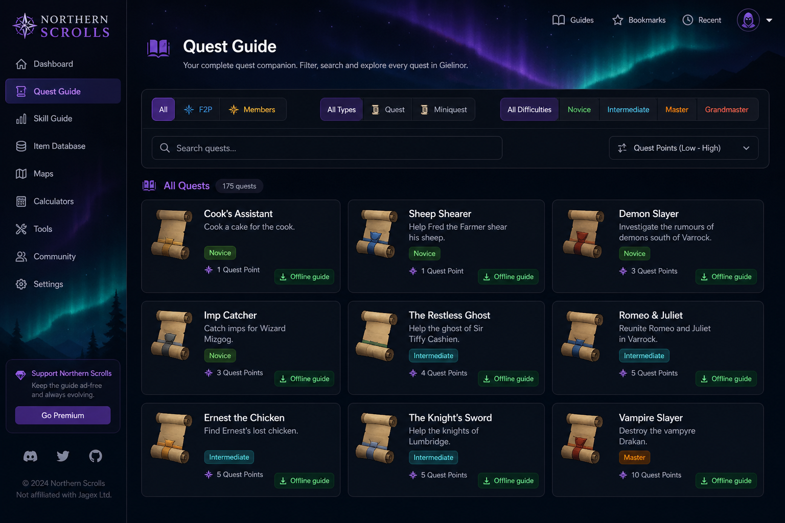

# 📜 RS3 Complete Guide — Skills, Money Making & Quests

An **offline-first**, single-page reference guide for [RuneScape 3](https://www.runescape.com/) built with React, Vite & Tailwind CSS. Designed to sit beside your game window without needing multiple tabs — everything is right here.

### 🌐 [Live Demo →](https://djsaintg.github.io/RS3-Companion-App/)


[](https://github.com/djsaintg/RS3-Companion-App/actions/workflows/deploy.yml)

## 💖 Support this Project

[](https://buymeacoffee.com/djsaintg)

---

## 📸 Screenshots

| Skills Guide | Money Making | Quest Catalogue |
|:---:|:---:|:---:|
|  |  |  |
| 29 skills with inline locations & embedded world map | Live GE prices, profit sorting, player skill filtering | 332 quests & miniquests with embedded Wiki guides |

---


## ✨ Features

### ⚡ Skilling Guide (29 Skills)
- Every RS3 skill with detailed **1-to-max training methods**
- Clear **F2P vs Members** separation with tabbed navigation
- Category filters: Combat, Gathering, Artisan, Support, Elite
- Each method includes: XP/hour, AFK level, cost, and **detailed inline location directions** (how to get there, nearby banks, landmarks)
- **Embedded RS3 World Map** (iframe) — toggle it open without leaving the page
- XP milestone reference table & XP Calculator

### 💰 Money Making Guide (27+ Methods)
- F2P and P2P methods sorted by GP/hour
- Step-by-step guides for each method
- **Live Grand Exchange prices** via the [WeirdGloop API](https://api.weirdgloop.org/) — refreshed on demand, cached in `localStorage` for offline use
- Estimated revenue calculated from live item prices
- Filter by category, sort by profit/effort, search

### 👤 Multi-Character Profiles (up to 20)
- Create and save up to **20 character profiles** (matching the Jagex account limit)
- Set individual skill levels for each character
- **Money-making methods auto-filter** to show only what your character qualifies for
- Switch between characters instantly
- All data persisted in `localStorage`

### 📜 Quest Guide (332 Entries)
- Complete RuneMetrics catalogue: **276 quests + 56 miniquests**
- F2P and Members separation with quest/miniquest and difficulty filters
- Bundled offline walkthroughs for the core quest set
- Verified RuneScape Wiki quick guides embedded inline for the complete catalogue
- Catalogue metadata cached locally after the first successful refresh
- No separate browser tabs required
- F2P and Members quests with full walkthroughs
- Skill requirements, Quest Point rewards, difficulty ratings
- Step-by-step walkthrough for each quest
- Tips and rewards listed clearly
- Quest series tags (Elf Series, Mahjarrat Series, etc.)

### 🧮 XP Calculator
- Calculate XP needed between any two levels (1–120)
- Input XP per action to see total actions required
- Visual progress bar

### 🌌 Aurora Borealis Theme
- Dark navy/black background with animated cyan, violet & emerald aurora effects
- Designed for extended use alongside the game — easy on the eyes

---

## 🚀 Quick Start

### Prerequisites
- [Node.js](https://nodejs.org/) 18+ and npm

### Linux / macOS (one-liner)
```bash
chmod +x launch_rs3skills.sh
./launch_rs3skills.sh
```

### Manual
```bash
# Install dependencies
npm install

# Build the production bundle
npm run build

# Serve locally
npm run preview
```

Then open [http://localhost:4173](http://localhost:4173) in your browser.

### Just the HTML file
After building, `dist/index.html` is a **single self-contained HTML file** (thanks to `vite-plugin-singlefile`). You can open it directly in any browser — no server needed:

```bash
# Linux
xdg-open dist/index.html

# macOS
open dist/index.html
```

---

## 🏗️ Project Structure

```
rs3-guide/
├── src/
│   ├── App.tsx                    # Main app with navigation & player profiles
│   ├── index.css                  # Aurora borealis theme + Tailwind
│   ├── main.tsx                   # React entry point
│   ├── components/
│   │   ├── MoneyMakingGuide.tsx   # Money making section
│   │   ├── QuestGuide.tsx         # Quest walkthroughs
│   │   ├── SkillCard.tsx          # Skill grid cards
│   │   ├── SkillDetail.tsx        # Skill detail with locations + map
│   │   ├── SearchBar.tsx          # Search input
│   │   └── XPCalculator.tsx       # XP calculator widget
│   ├── data/
│   │   ├── skills.ts              # All 29 skills + training methods + locations
│   │   ├── moneyMaking.ts         # Money-making methods + GE item tracking
│   │   └── quests.ts              # Quest data + walkthroughs
│   └── services/
│       ├── playerService.ts       # Multi-profile management (localStorage)
│       └── priceService.ts        # GE price fetching + caching
├── launch_rs3skills.sh            # One-click Linux/macOS launcher
├── index.html                     # HTML shell
├── vite.config.ts                 # Vite + React + Tailwind + SingleFile config
├── package.json
├── CHANGELOG.md
├── LICENSE
└── README.md
```

---

## 📡 Grand Exchange Price Refresh

When online, click the **refresh button** (🔄) in the header to fetch the latest item prices from the [WeirdGloop Exchange API](https://api.weirdgloop.org/). Prices are cached in your browser's `localStorage` so the guide works fully offline after the first fetch.

The app tracks **70+ commonly traded items** relevant to the money-making methods.

---

## 🤝 Contributing

Contributions are welcome! Some ideas:

- **Add more quests** — the game has 250+ quests; this guide covers the most important ones
- **Add more money-making methods** — especially new content
- **Update training methods** after game updates change XP rates
- **Add more locations** or improve directions
- **Improve the map integration** — perhaps embed specific coordinates
- **Add OSRS support** — a parallel data set for Old School RuneScape

To contribute:
1. Fork the repo
2. Create a feature branch (`git checkout -b feature/add-more-quests`)
3. Commit your changes
4. Open a Pull Request

---

## 👥 Authors

### 💡 Concept & Creative Direction
**djsaintg** · [GitHub](https://github.com/djsaintg) · RSN: `Guttenchat`

Original idea, product vision, and creative direction. The concept for an offline-first, single-window RS3 reference guide — including the F2P vs P2P separation model, multi-character profile system, inline location-based training guides, live GE price integration, the aurora borealis visual theme, and quest walkthrough section — is the intellectual property of djsaintg.

### 🤖 Application Development
**Claude** · [Anthropic](https://www.anthropic.com/)

All application code, architecture, data compilation, component design, and implementation were produced by Claude, an AI assistant made by Anthropic. This includes: React component architecture, TypeScript data models, Tailwind CSS styling, API integration logic, localStorage caching systems, the launch script, and all documentation.

---

## 📋 Data Sources & Credits

This project is an **unofficial fan-made guide** and is not affiliated with, endorsed by, or associated with Jagex Ltd.

### Game Data
- **[RuneScape Wiki](https://runescape.wiki/)** — Primary data source for skills, quests, training methods, locations, and game mechanics. The RuneScape Wiki is a community-maintained resource licensed under [CC BY-NC-SA 3.0](https://creativecommons.org/licenses/by-nc-sa/3.0/). Maintained by Weird Gloop Ltd.
- **[RuneScape Fandom Wiki](https://runescape.fandom.com/)** — Additional quest and skill reference data.
- **[RuneHQ](https://www.runehq.com/)** — Quest guide structures and reward references.

### APIs & Tools
- **[WeirdGloop Exchange API](https://api.weirdgloop.org/)** — Grand Exchange price data, provided by Weird Gloop Ltd (the team behind the RuneScape Wiki). See [API usage documentation](https://runescape.wiki/w/RuneScape:Grand_Exchange_Market_Watch/Usage_and_APIs).
- **[RS3 Interactive Map](https://mejrs.github.io/rs3/)** — Embedded world map by **mejrs**, built from RuneScape game cache data.
- **[RuneStats.info](https://runestats.info/)** — Referenced as a player lookup tool for verifying skill levels.

### Trademarks & Intellectual Property
- **RuneScape ®** is a registered trademark of [Jagex Ltd](https://www.jagex.com/). All game content, character names, skill names, quest names, item names, locations, lore, and game mechanics referenced in this guide are the intellectual property of Jagex Ltd.
- This project does **not** distribute any copyrighted game assets (sprites, music, textures, models). All icons used are Unicode emoji.

### Open-Source Technology
| Library | License | Copyright |
|---|---|---|
| [React](https://react.dev/) | MIT | Meta Platforms, Inc. |
| [Vite](https://vite.dev/) | MIT | Evan You |
| [Tailwind CSS](https://tailwindcss.com/) | MIT | Tailwind Labs, Inc. |
| [TypeScript](https://www.typescriptlang.org/) | Apache 2.0 | Microsoft Corporation |
| [vite-plugin-singlefile](https://github.com/nicojuicy/vite-plugin-singlefile) | MIT | — |
| [clsx](https://github.com/lukeed/clsx) | MIT | Luke Edwards |
| [tailwind-merge](https://github.com/dcastil/tailwind-merge) | MIT | Dany Castillo |

### Fonts
- **Cinzel** — designed by Natanael Gama · [SIL Open Font License 1.1](https://scripts.sil.org/OFL)
- **Inter** — designed by Rasmus Andersson · [SIL Open Font License 1.1](https://scripts.sil.org/OFL)
- Served via [Google Fonts](https://fonts.google.com/)

---

## 📄 License

This project is licensed under the **MIT License** — see [LICENSE](LICENSE) for details.

The game data referenced in this guide is sourced from community wikis under their respective licenses. RuneScape and all associated content are trademarks of Jagex Ltd.
